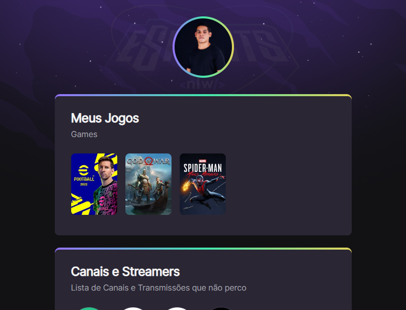

# <nlw/> NLW E-SPORTS

> TRILHA EXPLORER

[Acesse aqui!](https://4damanthys.github.io/N.L.W.-e-Sports_Set22)

Projeto elaborado no evento 'Next Level Week' (NLW) da Rocketseat.

## Linguagens e Sistemas:

- HTML ;
- CSS ;
- Git & GitHub ;

## Informações básicas:

Data de Início: 11/09/2022 ; \
Data Fim: 18/09/2022 ; \
Desenvolvido por: \
André Cunha a.k.a. Th3_4d@manthy$ ;\
Back-End Developer ;\
andre.holanda@outlook.com.br ;\
[Linked-In](https://www.linkedin.com/in/andreholanda90) / [Instagram](https://www.instagram.com/andreholanda_) ;